# React Native

## Documentación Oficial

Para verificar que no exista algún cambio, se recomienda revisar siempre la página oficial de React Native.

[Setting up the development environment · React Native](https://reactnative.dev/docs/environment-setup)

## Instalaciones recomendadas por Fernando Herrera

[Instalaciones recomendadas para el curso de React Native](https://gist.github.com/Klerith/e2c1fe2bcf5bfcd0a12fff653e725284)

## Instalaciones necesarias

### Node JS

Debemos tener instalado Node JS: [Página oficial de Node JS](https://nodejs.org/es/download/)

Verificamos si lo tenemos instalado con el siguiente comando:

```powershell
node -v
```

Si nos devuelve un resultado ese comando con la versión instalada, (se recomienda instalar la versión LTS), podemos continuar.

### Chocolatey

Lo siguiente a instalar, es Chocolatey: [Página oficial de Chocolatey](https://chocolatey.org/)

Ejecutamos **Power Shell** en modo administrador, y corremos el siguiente comando:

```powershell
Get-ExecutionPolicy
```

Si la respuesta del comando es **Restricted**, ejecutamos el siguiente comando:

```powershell
Set-ExecutionPolicy AllSigned
```

Si la respuesta es **AllSigned**,  podemos continuar, de lo contrario, ejecutamos el siguiente comando:

```powershell
Set-ExecutionPolicy Bypass -Scope Process
```

En caso de seguir con problemas, ejecutar lo siguiente:

```powershell
Set-ExecutionPolicy -ExecutionPolicy AllSigned -Scope Process
```

Para finalizar con la instalación de Chocolatey, correremos el siguiente comando:

```powershell
Set-ExecutionPolicy Bypass -Scope Process -Force; [System.Net.ServicePointManager]::SecurityProtocol = [System.Net.ServicePointManager]::SecurityProtocol -bor 3072; iex ((New-Object System.Net.WebClient).DownloadString('https://community.chocolatey.org/install.ps1'))
```

## Instalaciones para React Native

### JDK v8 o superior

Debemos tener instalada la versión 8 o superior de JDK, así como Node JS en su versión 12 o superior.

```powershell
choco install -y nodejs.install openjdk8
```

Si ya tenemos instalado el JDK, Chocolatey y Node JS podemos ignorar el comando anterior, si lo ejecutamos igual no pasa nada.

### Android Studio

Debemos tener instalado Android Studio: [Página oficial de Android Studio](https://developer.android.com/studio)

Una vez instalado, haremos algunas configuraciones en el SDK Manager.

Se recomienda utilizar **Android 10 (Q).** Podemos utilizar la 10, 11 o hasta el día de hoy la 12. En estos momentos la Sv2 se encuentra en modo Preview, lo cual no es recomendable utilizar, debido a que es posible que la versión que esté como Preview en ese momento, no funcione bien.

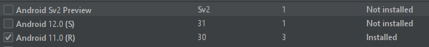

Para nuestro caso, utilizaremos la versión de **Android 11.0(R).**

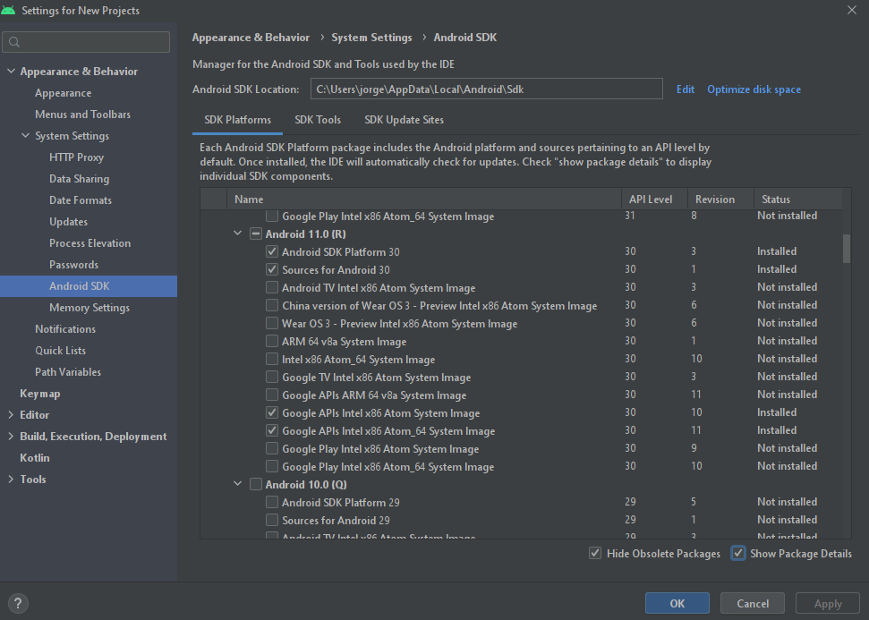

Seleccionamos Show Package Details, en la parte inferior derecha, para que nos aparezcan más detalles.

Habilitamos el check en las opciones que se muestran en la imagen de arriba. Debemos asegurarnos de tener habilidato el **SDK Platform 30** (para nuestro caso ya que estamos utilizando la versión de Android 11.0. Así mismo, habilitamos **Google APIs Intel x86 Atom System Image** y también **Google APIs Intel x86 Atom_64 System Image.**

Ahora, nos movemos al menú que dice **SDK Tools,** también seleccionamos **Show Package Details**.

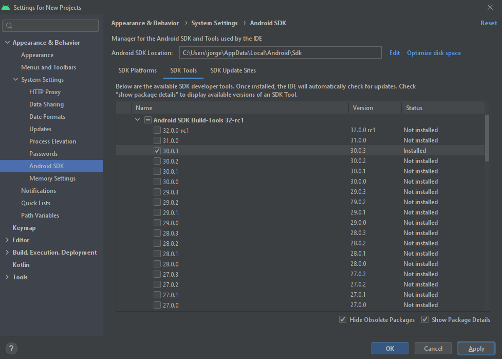

Verificamos que en Android SDK Build-Tools, tengamos seleccionada la opción 30.0.3. En caso de que no esté seleccionada, la seleccionamos, le damos en Aplicar, OK y cerramos la ventana.

### Configurar la variable de entorno ANDROID_HOME

Presionamos la tecla de Windows, y buscamos Variables de entorno.

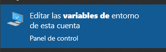

Seleccionamos variables de entorno:

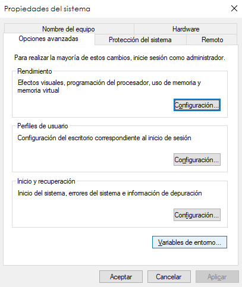

Una vez abierta la ventana, presionaremos en las variables de usuario, nueva:

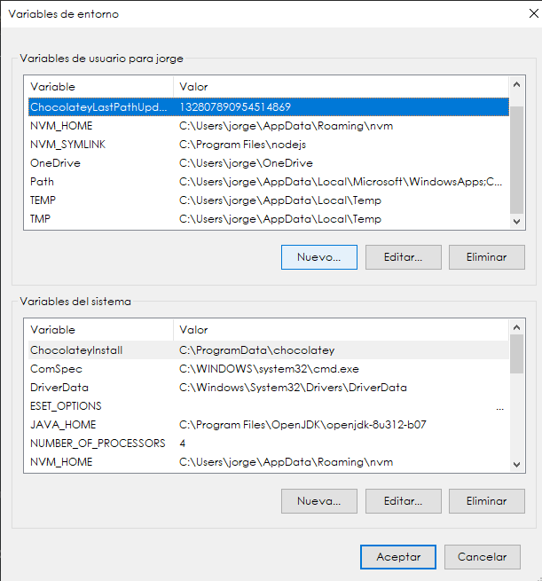

El nombre de la variable será **ANDROID_HOME**. El valor de la variable podría variar, para estar seguros de poner el correcto, abrimos el explorador de archivos:

- Ingresamos a la carpeta de **Usuarios**
- Ingresamos a la carpeta del usuario
- Buscamos la carpeta oculta que se llama **AppData** e ingresamos ahí
- Accedemos a la carpeta que se llama **Local**, dentro de AppData
- Ingresamos a la carpeta que se llama **Android**
- Accedemos a la carpeta que se llama **SDK**

La dirección efectiva será esa, ejemplo: **C:\Users\jorge\AppData\Local\Android\Sdk**

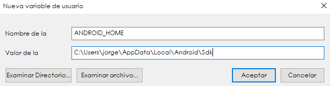

Ahora, sin cerrar la ventana de variables de entorno, verificaremos el Path mediante **PowerShell**, es importante que sea PowerShell o no funcionará, ejecutamos el siguiente comando:

```powershell
Get-ChildItem -Path Env:\
```

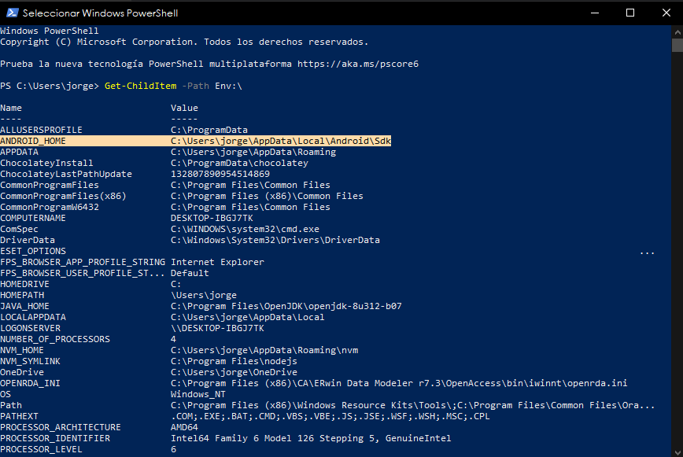

Continuando en nuestra ventana de variables de entorno, vamos a editar la variable de entorno llamada Path:

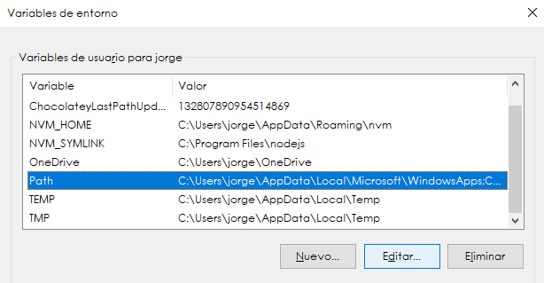

Daremos clic en **Nuevo**, y pegamos la misma dirección que teníamos anteriormente:

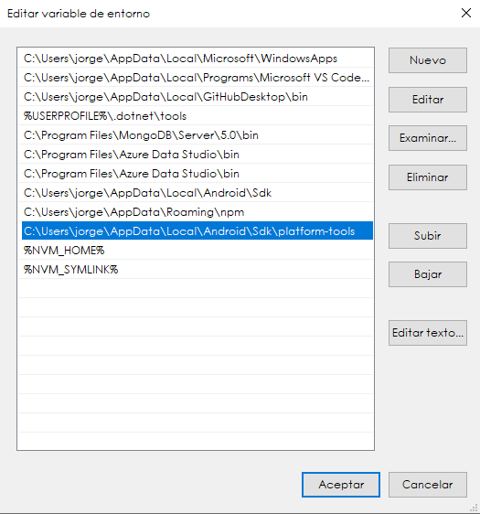

## Crear un dispositivo virtual

<aside>
💡 El emulador de Android Studio es muy pesado, si nuestro equipo de cómputo cuenta con 4GB de RAM, no será recomendable usarlo, de preferencia deberían de ser 8GB de RAM como mínimo para tener un resultado fluido. También podemos utilizar un dispositivo físico.

</aside>

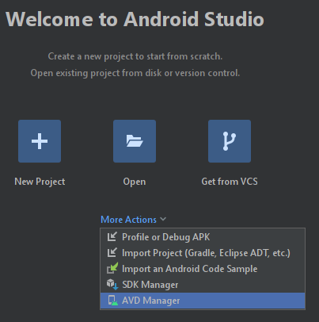

Nos dirigimos al AVD Manager, para administrar el dispositivo virtual. Para este ejemplo, seleccionaremos el dispositivo Pixel 4 XL, el cual es un dispositivo con pantalla grande. Lo seleccionamos y damos siguiente.

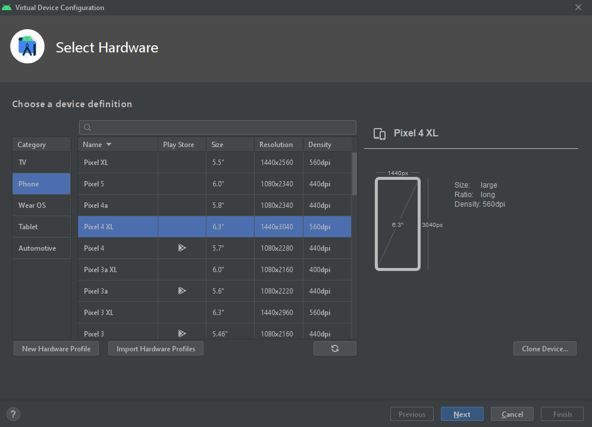

Seleccionamos la versión **R**, que es la que instalamos en el SDK, si no está descargada la descargamos y damos clic en siguiente.


Si contamos con una tarjeta de video independiente, seleccionamos acelerado por hardware, de lo contrario dejamos automática.

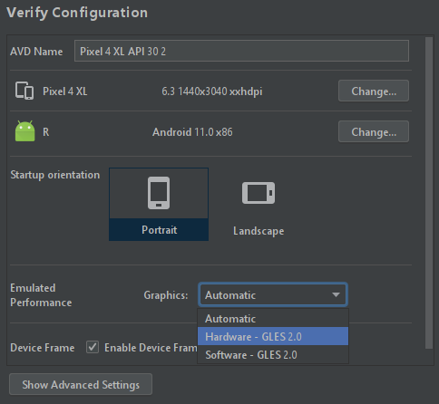

Si contamos con suficiente memoria RAM, podemos asignarle 4GB de RAM al dispositivo, en configuraciones avanzadas damos clic y configuramos la RAM asignada, si no contamos con suficiente memoria RAM, lo dejamos por defecto, o la que consideremos adecuada.

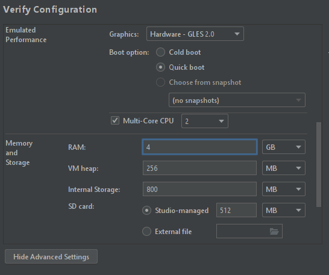

Una vez configurado, damos clic en Finalizar.

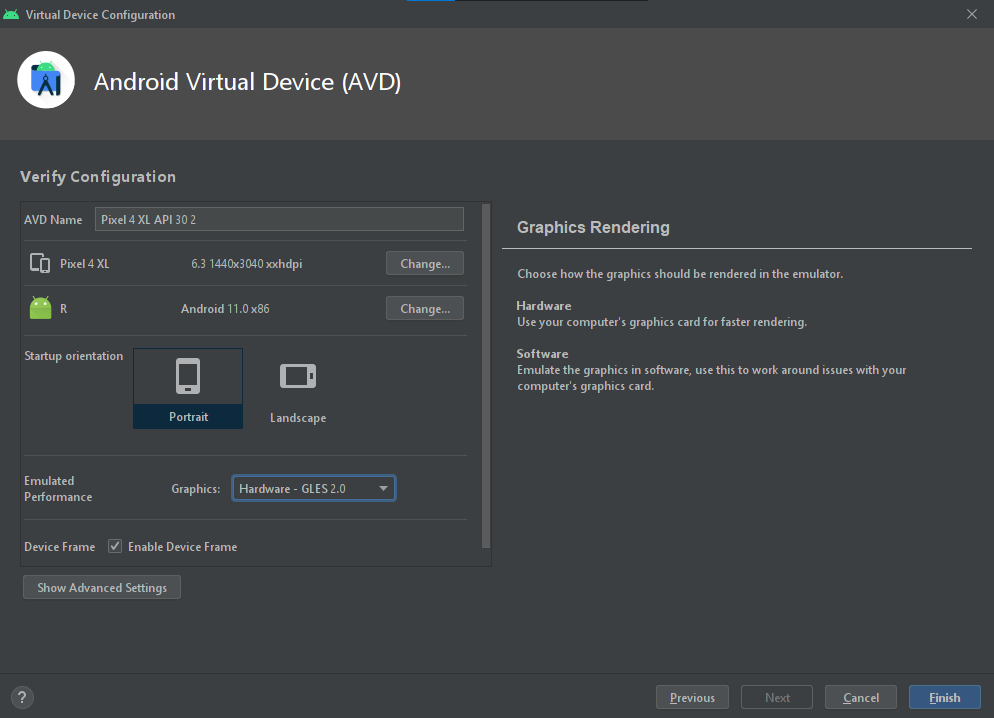

Podemos ejecutar el dispositivo, dando clic en Play:

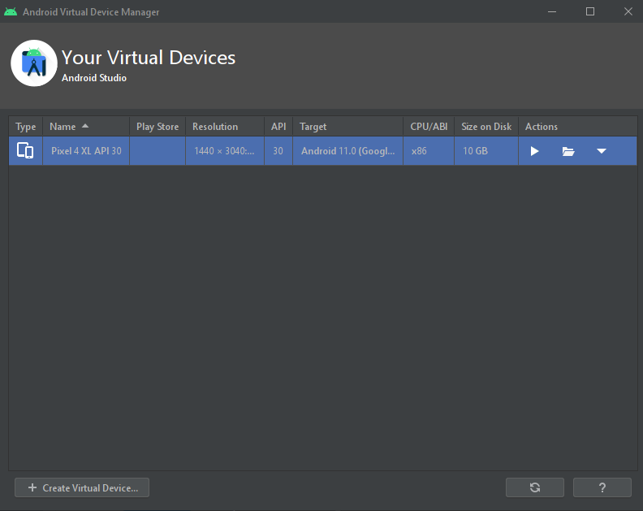

## Crear el proyecto de React Native

Comando para crear un proyecto de React Native con la plantilla de Typescript:

```powershell
npx react-native init AppDigiCSMMovCCNay --template react-native-template-typescript
```

Podemos acceder al comando cada vez que lo necesitemos en el siguiente link, proporcionado por Fernando Herrera:

[Comando para crear aplicación de React Native con TypeScript](https://gist.github.com/Klerith/89d5288dec7ff254913453d26a63e981)

## Ejecutar el proyecto creado

Comando para ejecutar la aplicación en Android:

```powershell
npx react-native run-android
```

Si solicita permisos, se los concedemos. La primera vez, tarda un buen rato en ejecutarse. Se abrirá una ventana de node que se llama Metro, la cual **no debemos de cerrar**, si la cerramos se cerrará la aplicación. En la ventana de metro podemos refrescar el proyecto, y también nos aparecerán los errores de consola, etc.
